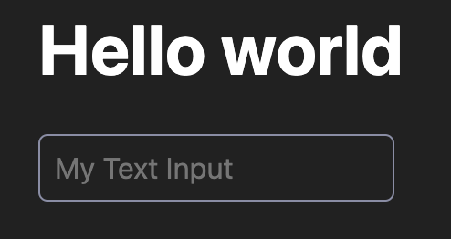

# Introducing JSX

**Remember Your First Website?** - Ah, the good ol' days! 
<br/>
Remember when you first ventured into web development? You proudly created your `index.html` file, slapped on an `index.css`, and thought, *"Wow, this is basically a masterpiece!"* Maybe you even threw in an `index.js` to get fancy with a button that didn't quite work, but hey, it changed something on the page!

```html title="index.html" icon="fa-file"
<!DOCTYPE html>
<html lang="en">
	<meta charset="UTF-8">
	<title>It's been a long time...</title>
	<link rel="stylesheet" href="./index.css">
	<body>
		<div>
			<h1>Hello world</h1>
			<input type="text" placeholder="My Text Input"/>
		</div>
	</body>
</html>
```

```css title="index.css" icon="fa-file"
body {
	/* Super fancy styles */
	background-color: red;
	color: green;
}

/* Styles for SaFarI */
body {
	-webkit-background-color: red;
}
```

Fast forward to today - introducing [JSX](https://facebook.github.io/jsx/) for [UIX](https://github.com/unyt-org/uix). With JSX, you can throw your old `.html` files into the digital attic. JSX takes all that nostalgia and cranks it up to 11 by letting you write HTML-like code directly in JavaScript / TypeScript!


If you plan to use JSX syntax inside of your UIX app, make sure to change your file's extension from `.ts` to `.tsx`.

All DOM elements (e.g. `<div>`, `<p>`, ``, `<svg>`, ...) can now be used within your TypeScript code as it was HTML:

```tsx
// That's magic, isn't it?
const myDiv = <div>Hello world</div>;
```

Alright, let's see an example in how to render something in our `entrypoint.tsx` that we can acutally see in the browser. For that we can just set our default export to some JSX element:

```tsx title="entrypoint.tsx" icon="fa-file"
export default <div>
	<h1>Hello world</h1>
	<input type="text" placeholder="My Text Input"/>
</div>;
```

Voilà, we'll see something like below when we run UIX and open the app in our browser *(styles are of course a bit off when using IE or SaFarI)*:



## Creating and handling DOMElements
If you've ever used React, you're probably familiar with the concept of the [Virtual DOM](https://legacy.reactjs.org/docs/faq-internals.html) — a lightweight, in-memory representation of the actual DOM that React uses to efficiently manage UI updates. However, in UIX, every JSX expressions returns real DOM elements, not virtual representations.

That means that value returned by following JSX expression is an actual instance of an [HTMLSpanElement](https://developer.mozilla.org/en-US/docs/Web/API/HTMLSpanElement) and we can use it as it was created by `document.createElement('span')` to modify properties or change its children.

```tsx
const mySpan = <span>Hello, UIX!</span>;
// Do whatever we want with the element
mySpan.innerText = 'Some other text';
document.body.append(mySpan);
```

UIX support a custom JSX flavour that is as close to original HTML as possible. That means we can set all common attributes for DOMElements (e.g. `id`, `class`, `style`, and `event` handlers) as we would do in HTML.

```tsx
document.body.append(<div id="myDiv">Hello, UIX!</div>);
document.body.querySelector("myDiv").innerText = "New content";
```