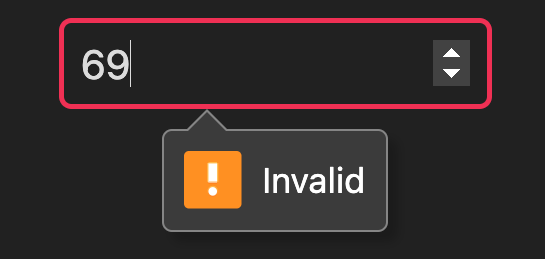

# JSX
UIX has built-in support for [JSX](https://facebook.github.io/jsx/) in `.tsx` files.

In UIX, JSX is used to create native DOM elements and components in a declarative way. JSX elements can be used interchangeably in both frontend and backend code.

> [!NOTE]
> UIX uses a custom JSX flavor called [JUSIX](https://github.com/unyt-org/jusix)
> which allows writing reactive code in a less verbose way. 


## Creating elements

All [native DOM](https://developer.mozilla.org/en-US/docs/Web/API/HTML_DOM_API) elements (e.g. `<div>`, `<p>`, ``, `<svg>` ...) can be created with JSX and used in your UIX application both on frontend and backend code. 

```tsx
const section = 
    <div id="section">
        <h1 style="font-weight: bold">Title</h1>
        <p>First Paragraph</p>
    </div>;
```

In contrast to frameworks such as React, the value returned by above JSX expression is an actual instance of an HTML element (in this case `section` is an instance of [HTMLDivElement](https://developer.mozilla.org/en-US/docs/Web/API/HTMLDivElement).

This means that you can directly modify created elements using common DOM APIs to update attributes, attach event listeners, or change style or children. You can also append created elements to others, such as appending them directly to the document body:

```tsx
const myElement = <p>Hello, UIX!</p>;
document.body.append(myElement);
```

## Supported attributes

For default DOM elements, all attributes that are natively supported by the element can be used in UIX.
Components support the common DOM element attributes (such as `id`, `class`, `style` or event handlers) by default, and can accept additional custom attributes defined in the [component class](./04%20Components.md) or function.


In UIX, you can define attributes directly on HTML elements. For example, the class attribute can be assigned a value as follows:

```tsx
<div class="my-div">
    Hello, UIX!
</div>
```

You can use dynamic values within curly braces `{}` in your attributes. This allows you to pass variables or expressions into the element attributes:

```tsx
const className = 'my-div';

<div class={className}>
    Hello, UIX!
</div>
```

For setting [inline styles](#style), UIX allows the use of an object notation within the style attribute. This is done using double curly braces `{{}}` such as shown in the following example:

```tsx
<div style={{color: 'red', backgroundColor: 'yellow'}}>
    Styled Text
</div>
```

Per default common HTML attributes are type safe to use, if you want to define custom data attributes, you can use the `data-*` notation. This is useful for embedding custom data that can later be accessed via your applications code. For example:

```tsx
const myArticle = {
    id: 42,
    title: 'My article #1'
};

<h1 data-article={myArticle.id}>
    {myArticle.title}
</h1>
```

## Reactivity

Thanks to DATEX, elements created with JSX are inherently reactive, even if they are not declared inside a component function like in React.
JSX elements accept plain JavaScript values *or* DATEX Refs as attribute values and element children.
Passing plain values does not dynamically update the component:

```tsx
let myClass = 'xyz';
const myDiv = <div class={myClass}>Hello, UIX!</div>
myClass = 'abc'; // myDiv class is still 'xyz'
```

To achieve reactive behavior, you can pass in a `Ref` value:
```tsx
let myClass = $('xyz');
const myDiv = <div class={myClass}>Hello, UIX!</div>
myClass.val = 'abc'; // myDiv class is now 'abc'
```

### Input attribute binding

To manage data binding between reactive `Refs` and input elements, we can use the `attr`, `attr:in`, and `attr:out` attributes for greater of data flow. These attributes allow for either **bidirectional** or **unidirectional** data binding, depending on the desired interaction between the `Ref` and the input.

Input reactivity works with native attributes such as [`value`](https://developer.mozilla.org/en-US/docs/Web/HTML/Element/input#value) or [`checked`](https://developer.mozilla.org/en-US/docs/Web/HTML/Element/input#checked) for [`HTMLInputElement`](https://developer.mozilla.org/en-US/docs/Web/API/HTMLInputElement), [`HTMLTextAreaElement`](https://developer.mozilla.org/en-US/docs/Web/API/HTMLTextAreaElement), and [`<select>`](https://developer.mozilla.org/en-US/docs/Web/HTML/Element/select) elements.

#### Bidirectional binding (`attr`)

Per default, all attributes are reactive and updated *bidirectionally*.
This means that if the attribute value is a `Ref`, the attribute will be updated when the `Ref` value is changed externally, and the `Ref` value itself will be updated when the attribute is changed, e.g. by user interaction in an input field:

```tsx
const inputText = $('Hello');

// add input element to the DOM
document.body.append(
    <input type="text" value={inputText}/>
);

// observe inputText changes, log every time the input value changes
observe(
    inputText, 
    val => console.log('Text changed to: ' + val)
);
```

#### Unidirectional binding (`attr:in`)
You can opt for *unidirectional* data binding to restrict how changes flow between the input element and the Ref.

The `value:in` and `checked:in` attributes only bind the value of the input element to the reactive `Ref`. The flow of data is one-way: when the `Ref` is updated, the value of the input or textarea element is updated, but changes in the input field made by the user do not modify the `Ref`'s value.

```tsx
const inputText = $('Hello');

// inputText updates will flow into the input field, but typing will not affect inputText
<input type="text" value:in={inputText}/>;

inputText.val = 'Hello, UIX!';
```

### Unidirectional binding (`attr:out`)
The `value:out` and `checked:out` attributes bind the input element to the reactive `Ref`, but in this case, only changes from the input element will update the `Ref`'s value. Changes made to the `Ref` won't reflect in the input field.

```tsx
const inputText = $('Hello');

// typing in the input will update inputText, but changes to inputText will not reflect in the input field
<input type="text" value:out={inputText}/>;
```

### Reactive expressions

Instead of single values, you can also pass in reactive expressions as attribute values or children.
Reactive expressions are automatically recalculated when one of the dependencies changes:

```tsx
const radius = $(0);

<div>
    <h1>Circle Area Calculator</h1>
    <input type="number" placeholder="Radius" value={radius}/>
    <p>Area = { Math.PI * radius ** 2 }</p>
</div>;
```

### Conditional rendering

With conditional rendering, specific elements are only rendered if a certain condition is met.
There are multiple ways to achieve conditional rendering with UIX.

#### Using ternary expressions

The simplest way to conditionally render elements is using ternary expressions:

```tsx
const showDialog = $(false);
const myDiv = <div>
    My Div
    { showDialog.val ? 
        <div id="dialog">My Dialog</div> :
        null }
</div>;
```

Note that instead of `showDialog`, the current value of `showDialog` (`showDialog.val`) is used in the ternary expression.
Otherwise, the ternary operator would always render the element, even if the Ref value is `false` because the Ref object itself is always truthy.

#### Using the `&&` operator

Alternatively, you can use the `&&` operator to conditionally render elements:

```tsx
const showDialog = $(false);
const myDiv = <div>
    My Div
    { showDialog.val && <div id="dialog">My Dialog</div> }
</div>;
```

This is especially useful if you want to render an element only if a certain condition is met and you have no need for an `else` case.

#### Using `toggle`

With the `toggle` function, you can achieve the same effect as with the `always` function, but it is more efficient, because the return values are only every created once.
The `toggle` function toggles between two values, depending on another input condition (in this case, `showDialog`): 

```tsx
const showDialog = $(false);
const componentInstance = <MyComponent/>;

const myDiv = <div>
    My Div
    {toggle(
        showDialog, // input trigger property
        componentInstance, // rendered if showDialog is true
        <span>Nothing to show</span> // rendered if showDialog is false
    )}
</div>;

showDialog.val = true;
```

If the value of `showDialog` is updated in the above example the of `myDiv` will toggle between `componentInstance` and the `span` depending if set to `true` or `false`.

#### Using the `display` style property

A different approach for conditional rendering is setting the `display` style property to a `Ref`: 

```tsx
const showDialog = $(false);
const myDiv = <div>
    My Div
    <div id="dialog" style={{display: showDialog}}>My Dialog</div>
</div>;
```
When `showDialog` is set to `false`, `display` is `none` and the div is not rendered.
Otherwise, `display` is `block` and the div is visible.

### Rendering lists

To render a list of elements, you can use the [`map`](https://developer.mozilla.org/en-US/docs/Web/JavaScript/Reference/Global_Objects/Array/map) function on an array and map it to return an array of JSX elements:

```tsx
const items = ['Item 1', 'Item 2', 'Item 3'];

<ul>
    {items.map(item => <li>{item}</li>)}
</ul>;
```

This also works with reactive arrays:

```tsx
const items = $(['Item 1', 'Item 2', 'Item 3']);

const list = <ul>
    {items.map(item => <li>{item}</li>)}
</ul>;

// add an item to the list
items.val.push("Item 4");
```

You can use other array functions such as [`filter`](https://developer.mozilla.org/en-US/docs/Web/JavaScript/Reference/Global_Objects/Array/filter), [`reduce`](https://developer.mozilla.org/en-US/docs/Web/JavaScript/Reference/Global_Objects/Array/reduce), [`forEach`](https://developer.mozilla.org/en-US/docs/Web/JavaScript/Reference/Global_Objects/Array/forEach) or [`find`](https://developer.mozilla.org/en-US/docs/Web/JavaScript/Reference/Global_Objects/Array/find) in the same way.


## Input validation

Input validation ensures that user inputs on [HTMLInputElement](https://developer.mozilla.org/en-US/docs/Web/API/HTMLInputElement) or [HTMLSelectElement](https://developer.mozilla.org/en-US/docs/Web/API/HTMLSelectElement) meet the expected data requirements of their bound `Ref`.

### Default input validation
In UIX, default input validation is automatically applied to both [HTMLInputElement](https://developer.mozilla.org/en-US/docs/Web/API/HTMLInputElement) and [HTMLSelectElement](https://developer.mozilla.org/en-US/docs/Web/API/HTMLSelectElement) elements. This guarantees that the value bound to a `Ref` remains valid, even when a user attempts to enter invalid data, such as text in a numeric input field. Depending on the input type, the system enforces validation for formats like numbers or bigints to maintain consistent and reliable input data. For non-numeric inputs, UIX will cast the values appropriately *(e.g. entering a number in a text field will still result in a text value)*.

```tsx
const myValue = $(0);

<input type="number" value={myValue}/>;
```
To disable the default input validation behaviour or change the validity message shown by the browser on invalid user input the `defaultInputValidation` of `domUtils` can be used:

```ts
import { domUtils } from "uix/app/dom-context.ts";

// Disable validation for <input type="number"/>
domUtils.defaultInputValidation.number.enabled = false;

// Override the validation message (depends on the browser)
domUtils.defaultInputValidation.bigint.message = 'Why, just why?';
```

### Custom input validation
In addition to default validation, UIX supports custom validation through assertion methods. These methods allow you to enforce specific rules for properties, such as requiring a `Ref`'s value to remain within a numeric range or ensuring that it has a specific length, format, or pattern — such as a valid email address.

#### `Ref` input validation
In the following example, we define a reactive `Ref` for a number input and ensure that its value is always less than 42 using the `assert()` method.


```tsx
const myValue = $(0);
myValue.assert((val) => val < 42);

<input type="number" value={myValue}/>;
```

If a user enters an invalid value — such as a number that doesn't satisfy the validation rule *(e.g. 69)* — the input state becomes invalid, and the browser will display an error message. 



You can enhance and customize this behavior using [`defaultInputValidation`](#default-input-validation), which provides more control over how validation errors are presented to the user.

To display custom assertion messages for invalid states, the `assert` method and decorator allow returning strings to be displayed as error messages:

```ts
assert(val => 
    val < 42 || 'Not in range!'
);
```

#### Class component input validation
You can use the `@assert` decorator to apply custom validation logic to your [Class component’s](./04%20Components.md#class-template-components) reactive [instance properties](./06%20Component%20States.md#the-property-decorator). This allows you to enforce specific rules by providing a callback function that acts as the assertion. Here's an example:


```tsx
@template(function() {
	return <input type="text" value={this.myEmail}/>;
})
class MyForm extends Component {
	@assert(val => /\S+@\S+\.\S+/.test(val))
	@property myEmail = 'max@unyt.org';	
}
```

## Special attributes values
Each attribute value can be set to a DATEX pointer.
When the pointer value changes, the attribute is updated accordingly.

Some attributes support special values that act as helpers to allow for easier modification, such as `event handlers`, `style` or `class`.

### Event handlers
All [event listener attributes](https://developer.mozilla.org/en-US/docs/Web/Events/Event_handlers) such as `onclick`, `onfocus`, or `oninput` can take a callback function as value:


```tsx
const btnDisabled = $(false);
<div>
    <button disabled={btnDisabled}>Submit</button>
    <button onclick={()=>btnDisabled.val=false}>Enable</button>
    <button onclick={()=>btnDisabled.val=true}>Disable</button>
</div>;
```

### Style

The `style` attribute accepts a string or an JavaScript object with style declarations. The style properties can be pointer values to allow for reactive updates:

```tsx
<div style={{color:'blue', padding:'10px'}}/>;
```

```tsx
const borderWidth = $(0);

// increase border width every second
setInterval(()=>borderWidth.val++, 1000);

<div style={{borderStyle: 'solid', borderWidth}}>
    Hello, UIX!
</div>;
```
Most style properties accept only string values. However, UIX allows special shortcuts for some CSS properties. The following style properties also take other values:
 * `display` - The display property accepts a `boolean` value. If the value is `true`, the `display` property is set to the default display value (e.g. `display: block` for a div). If the value is `false`, `display` is set to `none`.


### Scoped stylesheets

The special `stylesheet` attribute can be used on JSX elements to apply a whole CSS stylesheet to the scope of the element (See [Element-scoped styles](./12%20Style%20and%20Themes.md#element-scoped-styles])).


### Class
Similar to the `style' attribute, the `class' attribute takes a string or an object.
The object must contain the potential class names as properties and booleans as corresponding values, indicating whether this class should be set or not.

Simple class string:
```tsx
<div class="main big"/>;
```

Simple array list:
```tsx
const myClasses = ['main', 'big'];
<div class={myClasses}/>;
```

Reactive class object:
```tsx
const enableBig = $(false);
<div class={{main: true, big: enableBig}}/>; // class is set to "main"

// ...
enableBig.val = true; // class is now "main big"
```

### Paths

All attributes that accept a path as a value (e.g. `src` and `href`) can be set to paths relative to the current module (For additional information check out `uix-module` in [Supported Attributes](#supported-attributes)).

Relative paths in element attributes are always resolved correctly on the backend and on the frontend.

```tsx title="backend/entrypoint.tsx" icon="fa-file"
export default {
    '/img1': , // file is in common directory: can be resolved on the frontend
    '/img2': , // file is in backend directory: only accessible on the backend, not available on the frontend!
};
```
```tsx title="frontend/entrypoint.tsx" icon="fa-file"
export default {
    '/img3': , // file is in common directory: can be resolved on the frontend
    '/img4': , // file is in frontend directory: accessible on the frontend
};
```

You can use the special `href:route` attribute if you need paths that are relative to the current URL as displayed in the browser:

```tsx title="frontend/entrypoint.tsx" icon="fa-file"
export default {
    '/some/path' : <a href:route="./other-path"/>, // resolves to '/some/other-path'
    '/some/other-path': 'Hello there'
};
```

Instead of assigning string values, the [`URL`](https://developer.mozilla.org/en-US/docs/Web/API/URL/URL) object can also be set as path attribute.

### Checkbox `checked` attribute

The special `checked` attribute of a checkbox element can be used to set or get the `checked` state of a checkbox:

```tsx title="frontend/entrypoint.tsx" icon="fa-file"
const isChecked = $(false);

// Bind the 'checked' state of the checkbox to the isChecked pointer
export default <input type="checkbox" checked={isChecked}/>;

// Observe the pointer
isChecked.observe(checked => 
    console.log('checkbox is checked: ' + checked)
);
```

### Form actions

The `action` attribute of a [`<form>`](https://developer.mozilla.org/en-US/docs/Web/HTML/Element/form) element can be an URL or string containing the URL of the form request, or a [callback function](./05%20Entrypoints%20and%20Routing.md#entrypoint-functions) that is triggered on submit.

The return value of that function is rendered on the page and must be a valid [Entrypoint value](./05%20Entrypoints%20and%20Routing.md#entrypoint-values) (e.g. an HTML element, a string or a `Response` object).

```tsx title="backend/entrypoint.tsx" icon="fa-file"
// this function gets called when the form is submitted
function handleForm(ctx: Entrypoint) {
    // ...
    return "Form submitted";
}

export default 
    <form action={handleForm}>
        <input type="text" name="username"/>
        <input type="password" name="password">
        <button type="submit">Login</button>
    </form>
```

### Other UIX-specific attributes 

There are a few special attributes for UIX-specific functionality:
 * `uix-module` - specify the module path which is used as a reference for relative paths, e.g.:
     ```tsx
    
     ```
    This is only required for compatibility with Safari. In other runtime environments (e.g. Deno), the `import.meta.url` is always automatically inferred and does not have to be explicitly set.
 * `datex-pointer` - A boolean set to true if the element should be bound to a pointer. Pointers are automatically created for elements that are sent over DATEX. By default, only [class components](./04%20Components.md) are automatically bound to a pointer.

## Creating components

[Components](./04%20Components.md) defined with functions or component classes can also be instantiated with JSX.
In addition to the common DOM element attributes, all component options can also be set via type-safe JSX attributes if defined so:

```tsx
<MyComponent style="color:green" myParameter="Hello UIX!"/>
```


## Fragments

Fragments represent a minimal document object that has no parent. There are two ways to use fragments within UIX.

### DocumentFragments

You can create [HTML DocumentFragments](https://developer.mozilla.org/en-US/docs/Web/API/DocumentFragment) using the `<></>`-fragment tags:
```tsx
<>
    <div>Content 1</div>
    <div>Content 2</div>
</>
```

This is equivalent to 
```tsx
<DocumentFragment>
    <div>Content 1</div>
    <div>Content 2</div>
</DocumentFragment>
```
A fragment is collapsed into its child elements when appended to another DOM element.

> [!NOTE]
> Keep in mind that native DocumentFragments are *not reusable*.
> This means that after a fragment was appended to another element, it no longer has any content.
> If you want to directly return a top-level fragment for an entrypoint, you should always return it from a function, not as a single instantiation:
> ```tsx
> export default <>Content</>; // Don't do this
> export default () => <>Content</>; // This is correct
> ```
> Alternatively, you can use the [uix-fragment](#uixfragments) element.


### UIXFragments

A `uix-fragment` is a reusable fragment that is part of the actual DOM but is never rendered itself. All of it's children are visible in the DOM. It can be instantiated like this:

```tsx
<uix-fragment>
    <div>Content 1</div>
    <div>Content 2</div>
</uix-fragment>
```

UIX Fragments do not face the reusablity issues of [DocumentFragments](#documentfragments), but you need to keep in mind that they are always visible to CSS selectors:

```tsx title="App.tsx" icon="fa-file"
<div>
    <uix-fragment>
        <h1>Title</h1>
    </uix-fragment>
</div>
```

```css title="App.css" icon="fa-file"
div > h1 {
    /* this does not work */
}
div h1 {
    /* this works */
}
div > uix-fragment > h1 {
    /* this also works */
}
```

## Using `HTML` template strings

As an alternative to JSX, you can also use the `HTML` template string function which provides exactly the same functionality as JSX:

This is how we would do it in JSX:
```tsx
const count = $(0);
const div = 
    <div>
        <p>Count: {count}</p>
    </div> as HTMLDivElement;
```

If we don't want to use JSX, we can treat the DOM as template string and pass it to the `HTML` helper function:
```tsx
const count = $(0);
const div = HTML `
    <div>
        <p>Count: ${count}</p>
    </div>` as HTMLDivElement;
```

In contrast to JSX, the `HTML` function does not require an extra transpiler step and can also be used in plain `.js` files.

### DATEX injections

Besides JavaScript injections (with `${}`), the `HTML` function also supports reactive DATEX code injections with the `#()` syntax:
```ts
const count = $(0);
const div = HTML `<div>next count: #(${count} + 1)</div>`;
```
The expression inside `#()` is always handled as a transform function that results in a new reactive pointer value.

This is equivalent to a JavaScript `always()` transform function
```ts
const div = HTML `<div>next count: ${always(() => count + 1)}</div>`;
```
or a DATEX `always` command
```ts
const div = HTML `<div>next count: ${always `${count} + 1`}</div>`;
```

## Element return types

TypeScript has no support for dynamic return types for JSX declarations.
As a result, all JSX-generated elements must be explicitly cast to the correct class for proper HTML type handling. The same applies to elements created with the [`HTML`](#using-html-template-strings) helper function.

```tsx
const anchor = <a href="/link">Link</a> as HTMLAnchorElement;
```
```tsx
const anchor = HTML `<a href="/link">Link</a>` as HTMLAnchorElement;
```