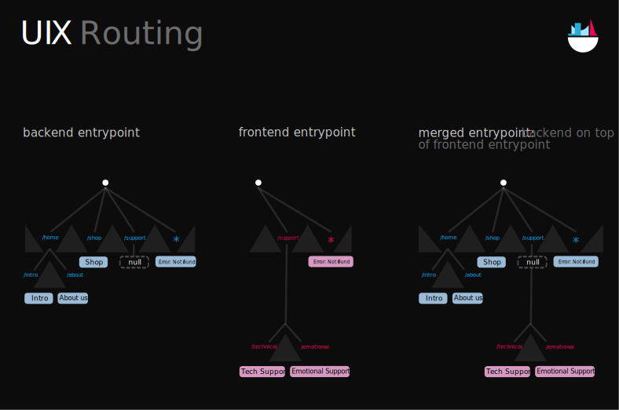

# Entrypoints

In a UIX app, UI is provided via default exports from the `entrypoint.ts`/`entrypoint.tsx` files located at the root
of the backend or frontend directories.

There is a variety of values that can be exported from an entrypoint to be displayed in the browser client, including strings, HTML Elements, Blobs and [more](#entrypoint-values).

Example Entrypoints:
```typescript
// backend/entrypoint.ts
export default "Hello, this is a simple text displayed on a website and loaded from the backend entrypoint"
```
```tsx
// frontend/entrypoint.tsx
export default 
    <section>
        <h1>Title</h1>
        <p>Description...</p>
    </section>
```

# Entrypoint Configurations
## 1. Just a Frontend Entrypoint
If there are no backend entrypoint exports, the UI is generated directly on each frontend client from the frontend entrypoint.
This configuration is useful for complex web applications with user-specific UI and also when the UI content
should not be available on the backend.

## 2. Just a Backend Entrypoint
UI generated on the backend entrypoint is "moved" to the frontend client.
UIX supports [multiple methods](./07%20Rendering%20Methods.md) for backend rendering.

## 3. Backend and Frontend Entrypoints (Route Merging)
When entrypoint exports for both the frontend and the backend are available, they are automatically merged.
This configuration normally only makes senses in combination with [Entrypoint Routes](#route-maps).


The following diagrams visualizes the concept of route merging in UIX:


Backend routes are always prioritized over frontend routes.

In this example, the route `/support/technical` follows the *frontend* entrypoint route and resolves to `Tech Support`.
The route `/home/about` is resolved on the *backend* to `About us`.

# Entrypoint values

## HTML elements
HTML Elements are directly appended to the document body. The can be created with
normal DOM APIs (`document.createElement()`) or with JSX syntax:
```tsx
import { Entrypoint } from "uix/html/entrypoints.ts";
export default <div>Content</div> satisfies Entrypoint;
```

Like other entrypoint values, HTML Elements are DATEX compatible and their content can be synchronized.
Keep in mind that the content is not updated when it is provided with [`renderStatic`](./07%20Rendering%20Methods.md#static-rendering).

```tsx
const counter = $$(0);
setInterval(()=>counter.val++,1000);

export default <div>Count: {counter}</div> satisfies Entrypoint
```

## Strings
Strings are displayed as text appended to the document body (color and background color depends on the current App theme).

Examples:
```typescript
export default "Hi World" satisfies Entrypoint
```
```typescript
const content = $$("content");
export default content satisfies Entrypoint;
content.val = "new content"
```
(If you only want to display plain text without a parent HTML document and CSS styles, you can use `provideContent("text content")`)


## Route Maps

Route Maps are simple JavaScript objects with route patterns as keys and entrypoint values as values.

When a URL is requested from the backend or loaded on the frontend, the most specific (longest) matching route entry is resolved to an entrypoint
value. 

A simple Route Map could look like this:
```tsx
export default {
    '/home': <HomePage/>,
    '/about': <div>About us...</div>
} satisfies Entrypoint
```

Since Route Maps are valid `Entrypoint` values, multiple Route Maps can be nested. Because a route part must exactly match the route pattern key,
the parent route key must end with `*` so that the route is followed.
```tsx
export default {
    '/articles/*': {
        '/first': 'First Article...',
        '/second': 'Second Article...'
    }
} satisfies Entrypoint
```


Besides the `*` syntax, many more patterns, like Regular Expressions, are supported in the Route Map keys. Internally, Route Maps use the [URLPattern API](https://developer.mozilla.org/en-US/docs/Web/API/URLPattern/URLPattern).
Matches can be accessed via the second argument in the callback function. The raw `URLPatternResult` can be acessed via `ctx.urlPattern`.

```tsx
export default {
    // Match user route with name
    '/user/:name/': (_ctx, {name}) => `Hello ${name}!`
    // Match page route using a Regular Expression
    '/page/(1|2|3)/': (ctx) => `This is page ${ctx.urlPattern.pathname.groups[0]}` 
    // Fallback if nothing else matches
    '*': 'Not found' 
} satisfies Entrypoint
```

## Route Map Filters

Route Maps also accept special symbols, called *filters* as keys.
They can be used to follow a specific route only if a certain condition is met.

One important use cases for filters are the `RequestMethod` filters that can be used to
route depending on the HTTP request method:

```tsx
export default {
    '/login': {
        // Provide login page
        [RequestMethod.GET]: provideFile("./common/index.html"),
        // Handle POST method triggered from login page    
        [RequestMethod.POST]: (ctx) => handleLogin(ctx)
    }
} satisfies Entrypoint
```

Custom route filters can be created with the `createFilter()` method from `"uix/routing/route-filter.ts"`:
```tsx

const isAdmin = createFilter((ctx: Context) => ctx.privateData.isAdmin)
const isPayingCustomer = createFilter((ctx: Context) => ctx.privateData.isPayingCustomer)

export default {
    '/api/*': {
        [isAdmin]:          ctx => handleAPICall(ctx, {rateLimit: Infinity}).
        [isPayingCustomer]: ctx => handleAPICall(ctx, {rateLimit: 1000}),
        '*' :               ctx => handleAPICall(ctx, {rateLimit: 10}),
    }
} satisfies Entrypoint
```

In this example, API calls are triggered with different rate limits depending on the type of
the requesting client.
The wildcard (`'*'`) selector can be used like with normal routes to provide a fallback behaviour
if none of the other cases match.

## Blobs
Blobs are directly displayed as files in the browser (Creating a file response with the correct mime type).

Example:
```typescript
export default datex.get('./image.png') satisfies Entrypoint
```

## Filesystem Files
In a deno environment, `Deno.FSFile` values can be returned as entrypoint values. They create a file response with the correct mime type.

The `provideFile()` function can also be used to return files from the local file system.

```typescript
import { provideFile } from "uix/html/entrypoint-providers.tsx";

export default provideFile('./image.png') satisfies Entrypoint
```

## Redirects

`URL` objects result in a redirect response (HTTP Status Code **304**) to the given URL.
This can also be achieved with `provideRedirect()`:

```typescript
import { provideRedirect } from "uix/html/entrypoint-providers.tsx";

export default provideRedirect('https://example.unyt.app') satisfies Entrypoint
```


## Virtual Redirects

Virtual redirects are similar to normal redirects, but they directly return a response with the content of the redirect URL, not a redirect response (HTTP Status **304**).

```typescript
import { provideVirtualRedirect } from "uix/html/entrypoint-providers.tsx";

export default provideVirtualRedirect('/example/home') satisfies Entrypoint
```

## Dynamic Entrypoint Functions
In the example above, a Dynamic Entrypoint Function is used to return custom content based on the context of a route.
Dynamic Entrypoint Functions take a single argument, a [`Context`](#uixcontext) object and return a `Entrypoint` or `Promise<Entrypoint>` 

Example:
```tsx
export default (ctx: Context) => {
    return `You visited this page from ${ctx.request.address} and your language is ${ctx.language}`
} satisfies Entrypoint
```

When an entrypoint function throws an error, the error value is returned like a normal return value, but with an HTTP Status Code **500**.

## UIX Components

UIX Components implement the [Route Manager](#route-managers) interface and can handle routes internally.
When a Component is encountered in the route chain, the `onRoute` method is called on the Component.


```typescript
class Component {
    // return the child element to which the route is resolved
    // if the route contains more sections, onRoute is called on this child element with the next route
    // section as the identifier
    onRoute(identifier:string, is_initial_route:boolean):Component|boolean|void
    // return internal state of last resolved route
    getInternalRoute(): Path.route_representation|Promise<Path.route_representation> 
}
```

### Example
Component Routing can be used to display or focus on different child components depending on the route.
```tsx
@template()
class Parent extends Component {
    #activeChild?: HTMLElement

    override onRoute(identifier:string) {
        // find the child that has the same id as the identifier
        this.#activeChild = this.shadowRoot.querySelector(`#${identifier}`);
        this.#activeChild?.focus();
        return this.#activeChild;
    }

    override getInternalRoute() {
        return [this.#activeChild.id]
    }
}

export default {
    // content for /about
    '/about': 'About us', 
    // content for /version
    '/version': 1,		  

    // content for all other routes
    // e.g. /a -> div#a is focused
    '*': <Parent>
            <div id="a">A</div>
            <div id="b">B</div>
            <div id="c">C</div>
         </Parent>
}
    
```

## Error handling

### Throwing values
Values that are thrown with `throw` from an entrypoint function are treated similarly to returned values - the value is still rendered in the browser. There is only one difference: The response has an error status code instead of the default status code 200.

```typescript
export default {
    '/:id': (_, { id }) => {
         if (id !== "4269420")
             throw "Invalid login"; // displays "Invalid login" with status code 500
         return "The secret is 42!"; // displays "The secret is 42!" with status code 200
     }
} satisfies Entrypoint;
```

### Throwing errors

Instances of `Error` that are thrown or returned from an entrypoint function are rendered in the browser as
an error info box (including a stack trace when running in `dev` stage).

```typescript
export default {
    '/:id': (_, { id }) => {
         if (id !== "4269420")
             throw new Error("Invalid login"); // displays an error info box (with stack trace)
         return "The secret is 42!";
     }
} satisfies Entrypoint;
```

### HTTPStatus

`HTTPStatus` values can be returned or thrown to create a response with a specific status code.
Additionally, custom content can be returned using the `with` method:

```ts
import { HTTPStatus } from "uix/html/http-status.ts";
export default {
    '/:id': (_, { id }) => {
         if (id !== "4269420")
             throw HTTPStatus.BAD_REQUEST.with("MyCustomMessage"); // displays "MyCustomMessage" with status code 400 (Bad Request)
         return "The secret is 42!";
     }
} satisfies Entrypoint;

```

## UIX Providers

UIX Provider utility functions allow backend entrypoint to directly return HTTP Responses from an entrypoint.

### List of UIX Providers:
 * ```typescript
   function provideValue(value:unknown, options?:{type?:Datex.DATEX_FILE_TYPE, formatted?:boolean})
   ```
   This function returns a HTTP Response with the mime type `application/json`, `application/datex` or `text/datex`,
   containing the serialized value. When the `options.type` is `Datex.DATEX_FILE_TYPE.JSON`, the value must be serializable with JSON.stringify. The default value for `options.type` is `Datex.FILE_TYPE.DATEX_SCRIPT`. In this configuration, any DATEX-compatible value can be provided.
 * ```typescript
   function provideContent(content:string|ArrayBuffer, type:mime_type = "text/plain;charset=utf-8", status?:number)
   ```
   Returns a HTTP Response with custom content and a custom mime type and status code.


## Route Handlers

Route Handlers are similar to [Dynamic Entrypoint Functions](#dynamic-entrypoint-functions), but they are represented with an interface. 
In contrast to a Dynamic Entrypoint Function, which only take a UIX Context as a parameter, the `getRoute` method of a Route Handlers additionally takes the remaining route as an argument.

```typescript
export interface RouteHandler {
    // return entrypoint for a route
    getRoute(route:Path.Route, context:Context): Entrypoint|Promise<Entrypoint> 
}
```


## Route Managers
The `RouteManager` interface represents an entity with an internal route state.
In contrast to other entrypoints, it can modify the request route.

When a Route Manager is encountered while resolving a route, the `resolveRoute` method is called with the remaining
part of the current route.
The Route Manager decides how to update its internal state and returns the part of the route that it could resolve.
The actual route on the client is updated to only contain this part.
The `getInternalRoute` should always return the route represented by the current state, and should match the route part returned by `resolveRoute`.

The `RouteManager` interface is implemented by UIX Components.

```typescript
interface RouteManager {
    // return part of route that could be resolved
    resolveRoute(route: Path.Route, context: Context): Path.route_representation | Promise<Path.route_representation> 
    // return internal state of last resolved route
    getInternalRoute(): Path.route_representation | Promise<Path.route_representation> 
}
```

## Entrypoint Proxies

An Entrypoint Proxy can be wrapped around any Entrypoint value to intercept routing and add custom functionality.
The abstract `EntrypointProxy` class has two methods that can be implemented:

```typescript
abstract class EntrypointProxy implements RouteHandler {
    /**
     * This method is called before a route is resolved by the entrypoint
     * It can be used to implement a custom routing behaviour
     * for some or all routes, overriding the entrypoint routing
     * 
     * The returned value replaces the entrypoint, if not null
     * 
     * @param route requested route
     * @param context UIX context
     * @returns entrypoint override or null
     */
    abstract intercept?(route: Path.Route, context: Context): void|Entrypoint|Promise<void|Entrypoint>

    /**
     * This method is called after a route was resolved by the entrypoint
     * It can be used to override the content provided for a route by returning 
     * a different entrypoint value. 
     * When null is returned, the route content is not changed
     * 
     * @param content content as resolved by entrypoint
     * @param render_method render method as resolved by entrypoint
     * @param route the requested route
     * @param context UIX context
     * @returns entrypoint override or null
     */
    abstract transform?(content: Entrypoint, render_method: RenderMethod, route: Path.Route, context: Context): void | Entrypoint | Promise<void | Entrypoint>
}
```


# Context

A UIX `Context` is created for each entrypoint request (when requesting a URL from a backend entrypoint or when redirecting to a URL on the frontend) and can be accessed in [Dynamic Entrypoint Functions](#dynamic-entrypoint-functions), [Route Managers](#route-managers) and [Route Handlers](#route-handlers).
It contains information about the client, about the route, and about the HTTP request (only on backend entrypoints).

```typescript
interface Context {
    request?: Request
    requestData = {
        address: string | null
    }

    path: string
    params: Record<string,string>;
    urlPattern?: URLPatternResult
    searchParams: URLSearchParams

    language: string
    endpoint: Datex.Endpoint

    getSharedData(): Promise<Record<string, unknown>>
    getPrivateData(): Promise<Record<string, unknown>>
}
```
