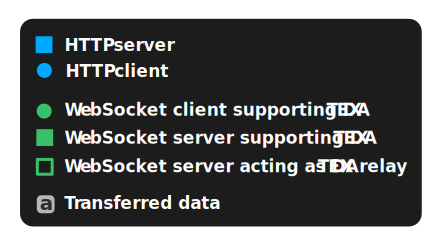
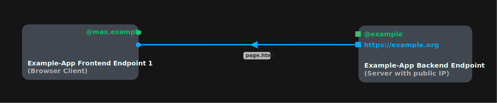
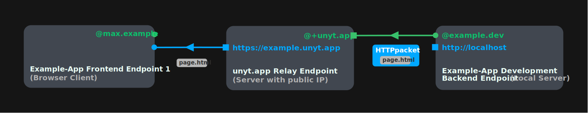
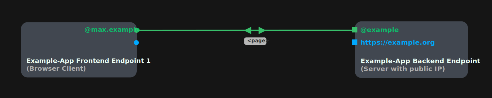
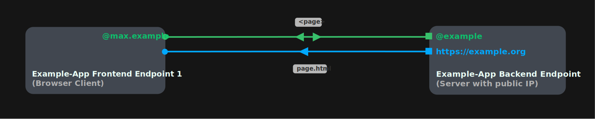
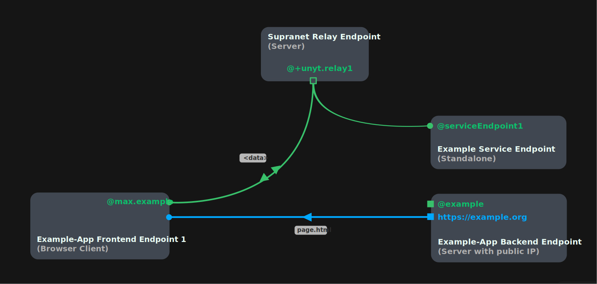
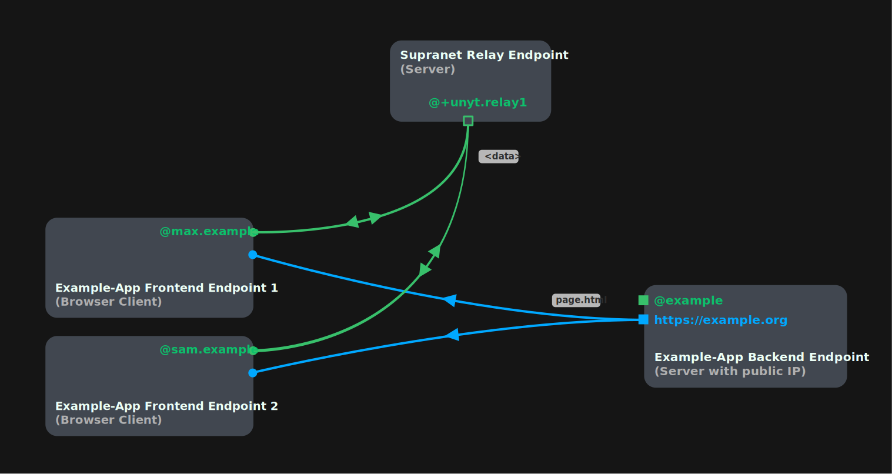
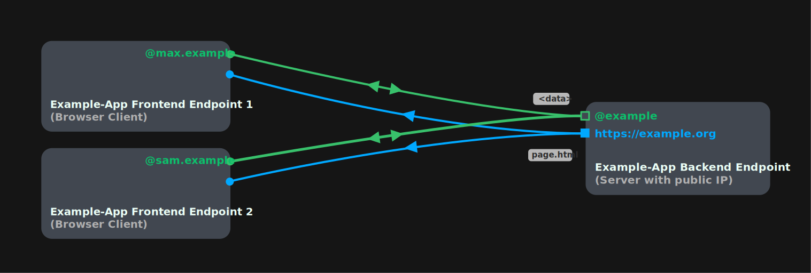
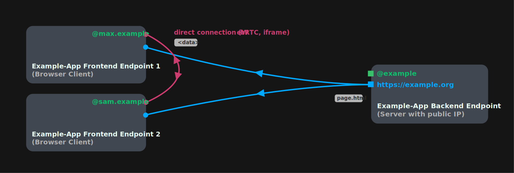
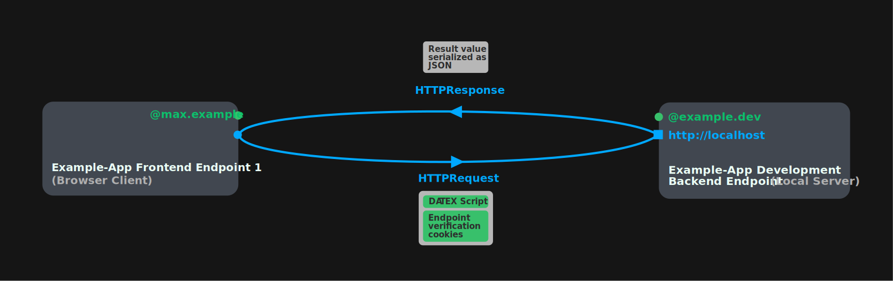

# UIX app communication in the Supranet

This chapter provides an comprehensive overview of data transfer strategies used
within UIX apps.
It provides background knowledge which is normally not relevant for developing UIX applications, but it can be useful to better understand the underlying mechanics of DATEX/UIX.

## Legend

# Providing files over HTTP

When a UIX backend server is directly accessible from the frontend via a public IP address,
static files are transmitted via HTTP from the backend to the frontend (The graphic is simplified and does not show the HTTP request/response separately):

# HTTP-over-DATEX

If the UIX backend is not accessible via a public IP address, static data can still be served with HTTP to the frontend client by using [HTTP-over-DATEX tunneling](./Glossary.md#http-over-datex) between the backend endpoint and a public relay endpoint:

# Transferring data via DATEX

Most data in a UIX app can also be directly transfered via DATEX (Some resources can currently only be transfered via HTTP, e.g. CSS files our JavaScript modules).
DATEX is especially useful for dynamic (reactive) data, but can also be used to transfer static data.

# Hybrid rendering with HTTP and DATEX

When using [hybrid rendering](./07%20Rendering%20Methods.md#hybrid-rendering), static HTML content is first served via HTTP and hydrated with dynamic DATEX data afterwards:

# Communication between endpoints via DATEX

DATEX is used to communicate with third-party endpoints or between client endpoints in the same app.

This can be achieved by communicating via a public endpoint relay server:

Alternatively, the UIX app backend can also serve as a relay server:

# Direct communication between endpoints via DATEX

It is also possible for two frontend endpoints to directly communicate via DATEX without a relay server. This can be achieved with end-to-end communication channels like WebRTC or iframe/window communication.

> [!NOTE]
> This graph simplifies how a WebRTC connection works. For an in-depth explanation,
> take a look at [WebRTC Communication Interfaces](https://docs.unyt.org/manual/datex/communication-interfaces#webrtc)

# DATEX-over-HTTP

If no DATEX connection can be established (e.g. when the DATEX runtime is not loaded on a client), [DATEX-over-HTTP](./Glossary.md#datex-over-http) can be used to send DATEX scripts over HTTP.

Similarly, the [HTTP Communication Interface](https://docs.unyt.org/manual/datex/communication-interfaces#http) can be used to transmit DATEX binary blocks via HTTP.

