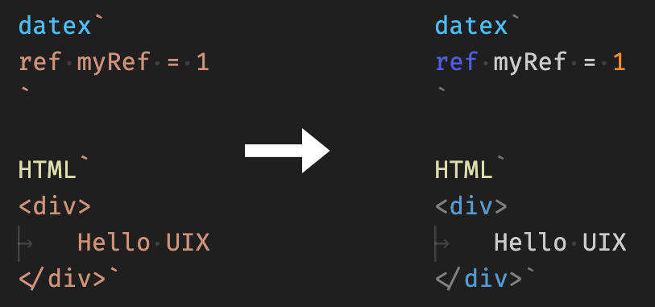

# DATEX Workbench

The [DATEX Workbench extension](https://marketplace.visualstudio.com/items?itemName=unytorg.datex-workbench) for [Visual Studio Code](https://code.visualstudio.com/) provides syntax highlighting for DATEX Script files (`.dx`) and inline DATEX, HTML and CSS in `.html` and `.ts` files. 

DATEX Script files can be compiled to DATEX Binary files (`.dxb`) with the DATEX Compiler command installed by the extension.

Syntax highlighting is especially useful if you are dealing with DATEX code inside your UIX application, or if you are using the [`HTML` method](./03%20JSX.md#using-html-template-strings) to embed JSX as template strings inside your code.

You can install the extension from the Visual Studio Marketplace [here](https://marketplace.visualstudio.com/items?itemName=unytorg.datex-workbench).