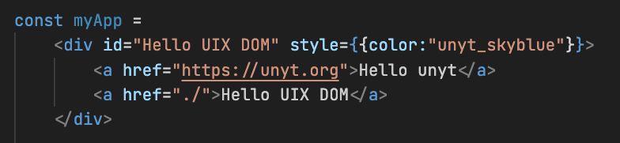

# UIX DOM

This library implements a standalone DOM subset based on [Deno DOM](https://github.com/b-fuze/deno-dom) that can be used in deno or in the browser.

UIX DOM also supports DATEX bindings for DOM elements from the UIX DOM library, as well as for normal browser DOM elements.



## Loading the DOM Context

To get started, import the context from "mod.ts":

```ts
import * as context from "../uix-dom/dom/mod.ts";
```
This context includes definitions for all Elements, as well as a `document` object.
It can be used interchangably with the `globalThis` object in the browser.

## Enabling DATEX bindings

By enabling DATEX bindings for a `DOMContext` object,
the corresponding DATEX type definitions are mapped to the DOM context
and reactivity is enabled.

```ts
import { enableDatexBindings } from "./datex-bindings/mod.ts";
const domUtils = enableDatexBindings(context);
```

## Enabling JSX

```ts
import { enableJSX } from "./jsx/mod.ts";
const {jsx, jsxs, Fragment} = enableJSX(domUtils, context);
```